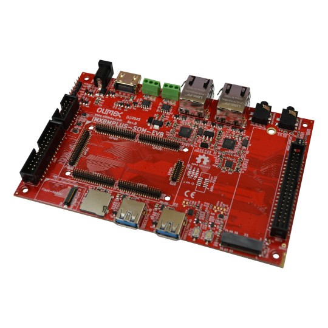

# iMX8MP-SOM-EVB

Development board for i.MX8MPlus System on Module with iMX8 SOC

https://www.olimex.com/Products/SOM/NXP-iMX8/iMX8MP-SOM-EVB-IND/

https://www.olimex.com/Products/SOM/NXP-iMX8/iMX8MP-SOM-4GB-IND/open-source-hardware

## Licensee
* Hardware is released under CERN Open Hardware Licence Version 2 - Strongly Reciprocal
* Software is released under GPL V3 Licensee
* Documentation is released under CC BY-SA 4.0
